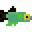

#  Platyfish TypeScript Physics Library

Platyfish is a 3D physics library for physical simulation purposes.

Planned features
* Collision detection between Points, Lines, Planes, Spheres, Capsules, and Axis Aligned Bounding Boxes
* General collision detection between convex objects using Minkowski Differences
* Bounded volume hierarchy for reducing computational complexity
* A Posteri based time stepped simulation
* Lagrangian particle systems
* Eulerian finite element method systems